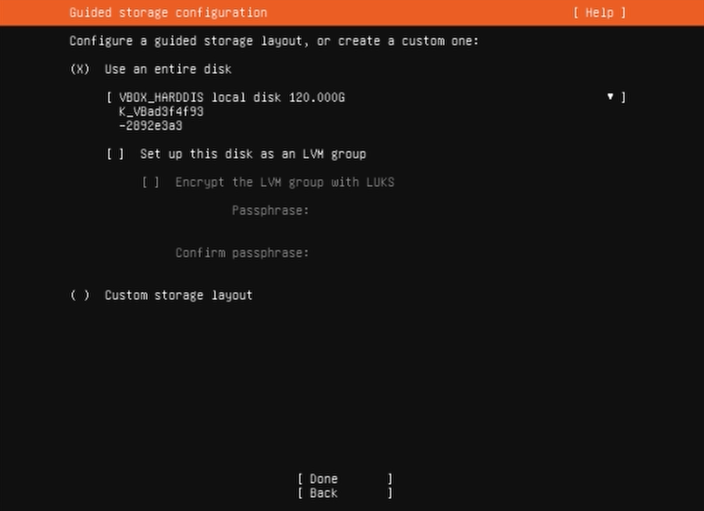

# Ubuntu Server Installation

Download link for iso: https://ubuntu.com/download/server

Flash the iso file to a Flash Drive.
- I recommend rufus.ie if you're using a Windows system
- If you're on Linux, try belenaEtcher

BIOS settings: disable secure boot

Boot from the flash drive and install Ubuntu with default settings except:
- No GUI install, just command line
- Enable SSH
- Uncheck 'Set up this drive as an LVM group'. It would split the drive into multiple volumes which is not helpful in this scenario.


Disable sleep function when closing lid (for laptop):
```bash
sudo nano /etc/systemd/logind.conf
```

Find the line for 'HandleLidSwitch' and uncomment it and change it to HandleLidSwitch=ignore. Your config should look like this:
```bash
...
#HandleHibernateKey=hibernate
HandleLidSwitch=ignore
#HandleLidSwitchExternalPower=suspend
...
```